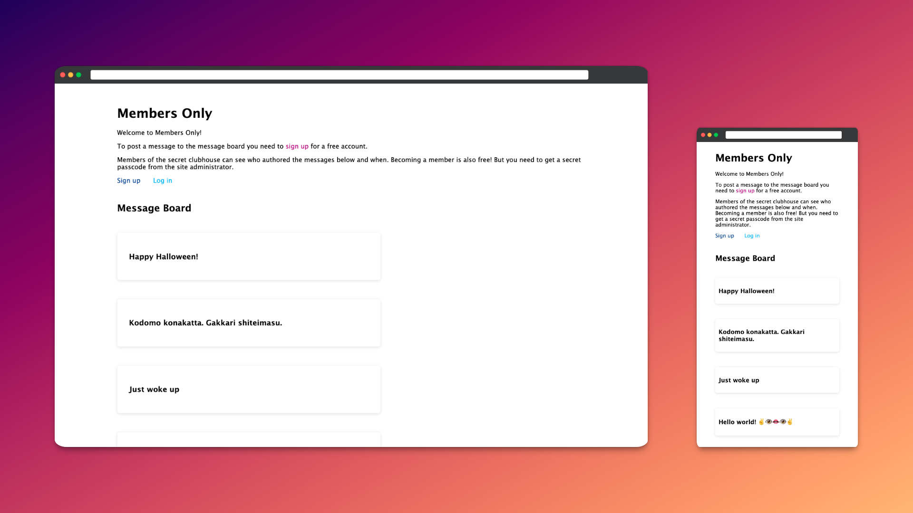
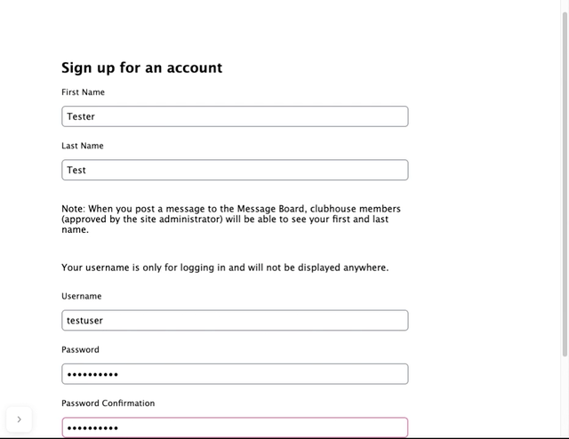

<h1 align="center">Members Only</h1>

Session-based authentication and user permissions project from TOP

## Description
This app is my solution to The Odin Project [Members Only](https://www.theodinproject.com/lessons/nodejs-members-only) assignment. The task is to create a message board with four levels of user permissions managed with session-based authentication in PassportJS.

## Project Objectives
- Users and messages should be stored in MongoDB and modelled in mongoose
- Server-side sessions should manage four levels of user permissions: public (logged out), users, members, and admin
- User passwords should be encrypted with `bcrypt`
- Only members should be able to see the authors of posts to the message board, and only admins should be able to delete messages

## Usage
Visit [the live site](https://members-only-2mwt.onrender.com/) to view the message board (Note: the free tier Render web service is sometimes *very* slow to spin up, but should start eventually).

Create a free account (email is not required and your password is encrypted) to post to the message board.

## Demo

## Technologies used
- [Express](https://expressjs.com/)
- [MongoDB](https://www.mongodb.com/)
- [Mongoose](https://mongoosejs.com/) MongoDB ODM for Node.js
- [express-validator](https://express-validator.github.io/docs/) Express middleware for validation and sanitization
- [PassportJS](https://www.passportjs.org/) Simple, unobtrusive authentication for Node.js
- [bcrypt.js](https://github.com/dcodeIO/bcrypt.js) Optimized bcrypt in JavaScript with zero dependencies
- [EJS (Embedded JavaScript)](https://ejs.co/) View templating engine
- [Render](https://render.com/) Cloud application hosting
